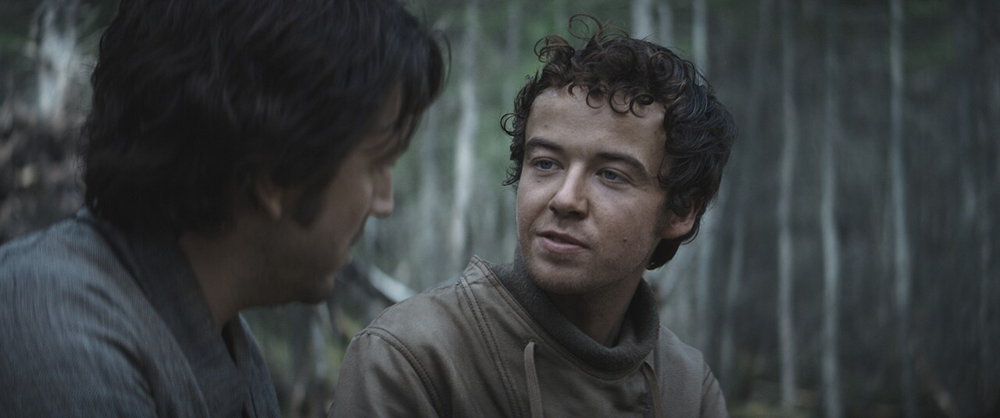

---js
const title = 'On atrocities';
const date = '2026-02-28';
const summary = '“The tree remembers, but the axe forgets.”';
const image = 'quote.jpeg';
const showImage = false;
const tags = ['fascism', 'immigration', 'Star Wars', 'trans rights', 'war'];
const eleventyComputed = {
  introSummary: function(data) {
    return data.summary;
  },
};
---

It's hard to know what to say about all the terrible things happening in or created by the United States these days --- disappearing immigrants in Minnesota and everywhere, covering up for years of sexual abuse, stripping trans people of their rights in Kansas, or bombing schools in Iran; the list goes on and on and on. I'm reminded of a quiet conversation from <cite>Andor</cite>,[^1] between Karis Nemik and Cassian Andor:

> The pace of repression outstrips our ability to understand it. And that is the real trick of the Imperial thought machine. It’s easier to hide behind 40 atrocities than a single incident.

[^1]: "The Axe Forgets" (season 1, episode 5)
