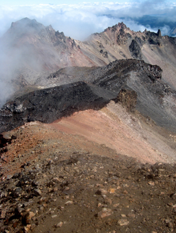

On Monday, Erica and I climbed [Diamond Peak](http://en.wikipedia.org/wiki/Diamond_Peak_%28Oregon%29) with Kirstin; her boyfriend,^[This is an infantilizing term. Is there an alternative?] Ryan; my uncles Steve & Mason; and my aunts Linda & Lorraine. Zora had a grand time with Grandma Vivian in Eugene. It was cold & misty, and Kirstin, Ryan, and I accidentally started from the wrong trailhead --- so the hike ended up being three miles longer for everyone --- but we eventually made it to the summit, only an hour behind schedule. The hike was worth it!

<figure>

<figcaption>A view from the summit of Diamond Peak, Oregon</figcaption>
</figure>
